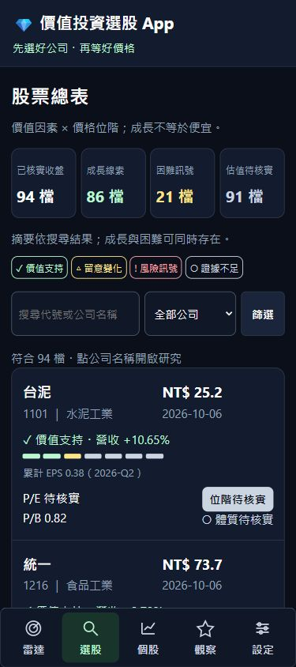
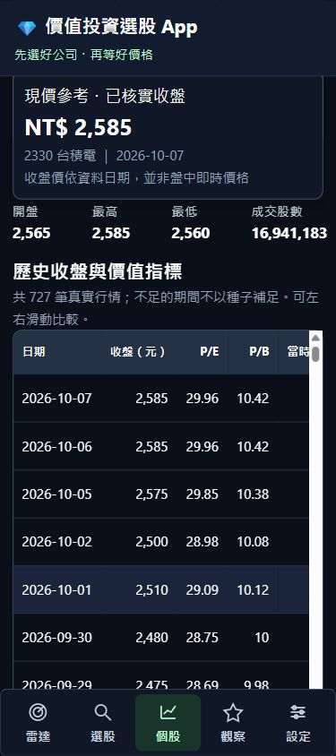
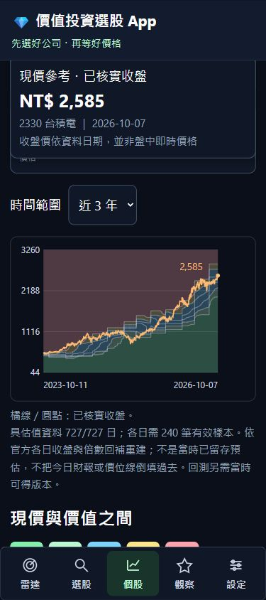

# 參考畫面落地與時間序列資料儲存設計

使用者於 2026-10-07 核准原 A→B→C→D 工作流，並補充三張參考畫面。本次追加：股票總表、歷史收盤與價值指標表、真正隨時間變動的河流圖。以下為實作規格與平台建議；不代表所有歷史資料已取得。

## 畫面結構

1. 股票總表：上方列示已核實行情、成長線索、困難訊號與資料完整性；下方每列集中顯示公司、收盤價／日期、營收成長、已實現累計 EPS、P/E、P/B、公司／價格狀態。手機採緊湊列，桌面可橫向比較。淺綠支持成長、琥珀待留意、珊瑚紅警示風險、灰色未知，不使用單純股價漲跌代表投資價值。
2. 個股基本面：上方共用現價、日期與 OHLC；下方按日期列示收盤、P/E、P/B、當時可得 TTM EPS。資料不知道就顯示「—」，不得把今日 EPS、ROE 或 PEG 倒填過去。
3. 價位頁：時間軸＋收盤線＋六條估值線與五種價位色帶；每個日期 t 使用官方該日倍數、同日基本值與截至該日的滾動窗口，屬於事後歷史重建，不宣稱當时已保存模型或預估。真實樣本不足時呈現價格線／資料缺口，不畫生成估值線。沒有完整過往資料時明示，而不是讓圖看起來完整。

每個個股子頁重複同一筆收盤價；沒有盤中源時不稱即時價。預設 3 年，可選 1／2／3 年；空白不是零元。河流圖暫定採可設定分位數，不宣稱為孫慶龍未公開的精確公式，另列歷史平均倍數供參考。

## 三個時間不能混為一談

| 時間 | 意義 | 例子 |
|---|---|---|
| period / trade_date | 數字所屬期間 | 2026-Q2 財報、10/6 收盤 |
| available_date | 市場可取得資料的日期 | 公告日；缺公告日時採較保守出表日期 |
| observed_at / revision | 本系統何時取得這個版本 | 10/7 匯入；後續修正另存版本 |

只有期間，沒有公告與版本，就容易產生未來資訊偏差。保存最新表做日常查詢，也保存不可覆寫的版本表做時間點重現。同日收盤與財報公告時間若無精確時分，回測採盤後判定、下一交易日真實開盤成交；不聲稱知道盤中當時可得狀態。

## 已實作與後續建議資料表

| 表／資料集 | 唯一鍵與關鍵欄位 | 用途 |
|---|---|---|
| stock_master | ticker、市場、產業、有效起迄 | 公司識別，不把今日名單當歷史股池 |
| market_evidence | dataset + ticker + period、來源、可得日、單位、hash | 正式可用的最新原始證據 |
| market_evidence_revision | ticker + dataset + period + 版本、observed_at、available_date、原值 | 追加保存版本，不用今天修正版改寫昨天判斷 |
| price_daily | ticker + trade_date、OHLC、close、volume、倍數 | 真實每日行情；未還原行情與調整事件分開 |
| financials | ticker + fiscal_period + report_scope + revision、公告時點 | 累計／單季／合併／個體不可混算 |
| corporate_actions | ticker + effective_date + event_id | 分割、減資、除權息及支付日期 |
| etf_membership_history | etf + ticker + effective_date、removed_date、權重、可得日 | 防止存活者偏差；不以現有股池回測 |
| valuation_daily | ticker + date + metric + variant + model_version | 各日的基本值、240 日樣本、倍數、P1–P6、缺口及來源版本 |
| forecast_revision | ticker + target_year + created_at + model_version | 真正累積當時預估，未來才可計算誤差校準 |
| ingestion_run | run_id、來源、擷取時間、成功／失敗、raw_path、hash | 能追溯每次更新、重試與快照 |

已實作 stock_master、market_evidence、market_evidence_revision、price_daily 及時間序列 API。表內 financials 為後續擴充規格；目前已核實累計損益保存在 income_ytd 證據資料集。corporate_actions、etf_membership_history、valuation_daily、forecast_revision、ingestion_run 仍為建議，尚未建立完整正式寫入管線。現階段沿用 SQLAlchemy 與 SQLite。尚未具備的財報、股數、ETF、事件不以種子填入；正式 EPS／推播／回測保留待核實狀態。原始官方 JSON 另存報告資料夾；日後可移到物件儲存。

## 平台選擇

**目前建議：D 槽本機 SQLite 作為主資料庫，GitHub Pages 作為唯讀分檔快照。** 94 檔 × 每年假設 252 交易日 × 10 年約 23.7 萬行情列；以日資料與單一更新程序而言，現在先換雲端並不能補好資料品質。保留交易式匯入、索引、備份與來源查核，比增加平台更優先。

WAL 可改善同一主機的讀寫並行，但仍只有一個寫入者，也不適合在網路共享檔案系統由多主機共寫。不能把運作中的 `.db`、`-wal`、`-shm` 放在同步硬碟讓兩台電腦同時改；用 SQLite 備份 API 產生一致快照再搬移。[SQLite WAL 官方說明](https://www.sqlite.org/wal.html)

**當需要跨裝置筆記、多人帳號或常駐服務，再採 PostgreSQL＋API＋排程工作程序。** 行情用 ticker／date 索引；資料量與查詢實測需要時才按年份分區。版本、模型、公告日期仍需保留，換資料庫不會自動解決時間偏差。[PostgreSQL 分區官方說明](https://www.postgresql.org/docs/current/ddl-partitioning.html)

Supabase 是可評估的託管 PostgreSQL 選項；若直接讓登入使用者存取觀察與筆記，要設計 Row Level Security，以使用者 ID 隔離資料。服務金鑰不得放進 Pages HTML。此建議不含購買方案、開帳號或上傳私人內容的授權。[Supabase RLS 官方說明](https://supabase.com/docs/guides/database/postgres/row-level-security)

**Pages 並非資料庫或盤後排程主機。** 每日更新必須由本機／常駐伺服器／排程工作取得資料、驗證後，再匯出快照。靜態頁上的新增觀察與筆記只能實際寫入該裝置；若要跨裝置同步，需登入的後端。個人筆記與 LINE 身分不放進公開資料快照。

## 保存與驗收

- 日行情追加累積；同一資料期有修訂另留版本；新匯入不得覆寫舊版本。
- 完整累計損益先分清楚報表口徑；Q2 累計減 Q1 累計才能得 Q2，缺 Q1 就未知；TTM 須連續四季。
- 更新失敗維持來源原日期；不得複製舊值假造今日成功。讀取頁面不觸發市場資料寫入。
- 河流圖在各時點重算過往窗口；EPS 公布時可能階梯變化，倍數窗口變化也可能使線變動。預估線與已實現線分開標示。
- 備份以 SQLite backup API；恢復測試、完整性檢查、逐筆來源比對後才能正式發布。
- 平台遷移另提遷移與帳號隔離計畫；本次不改用外部雲端資料庫。

## 本次實際回補範圍

台積電（2330）、鴻海（2317）、聯發科（2454）已回補 2022-10 至 2026-09 的官方日行情與 P/E、P/B，分別 967／966／967 筆，共 2,900 筆，144 個股票月份均成功。另補 2026-10 至 10/7 的 15 筆，三檔合計 2,915 筆；期間由 2022-10 至 2026-10-07。其他 91 檔尚未全量回補歷史；來源未提供的 P/S、歷史 ROE、PEG 與可用財報版本保持未知。河流色帶以各日 240 筆窗口重算，不把今日的六條價位線往過去平移；本系統分位數法仍屬研究模型。

本次歷史回補在 10/7 才觀測到，不能據此宣稱系統在過去已知道資料。嚴格時間點回測仍由可得日及 observed_at 約束，且需當時 ETF 名單、除權息及分割等完整證據。

## 正式介面驗證畫面

以下是正式程式搭配已核實資料的 390px 畫面。

本機全套153項測試通過；320／390／430px沒有頁面水平溢出，五個入口約64px，320px長輩超大字約68px。六個子頁皆顯示同收盤2585元與10/7日期。SQLite完整性、備份完整性及3,180筆最新證據hash核對通過；三檔四種歷史指標的API與靜態資料相等（P/S維持未知）。詳細數量見正式驗證結果.json。

## 每日累積方式

以盤後單一程序依序執行 refresh_verified_data.py、backfill_verified_history.py --current-only、資料查核，再執行 export_gh_pages.py。當月月查詢每次重取，不永久快取；新舊原始回應另留更新版本。完整月份預設重用已取得檔案，官方修訂查核時使用 --refresh 強制重取，資料庫保留修訂證據。排程預設關閉；先完成所需資料來源與更新成功驗收，再依使用者需求啟用每日工作。只匯出本機快照，不自動發布 GitHub 或發送 LINE。
