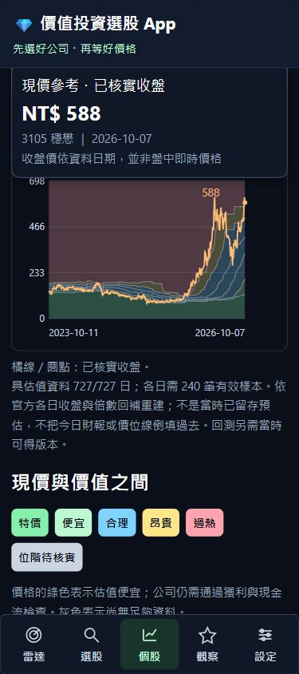
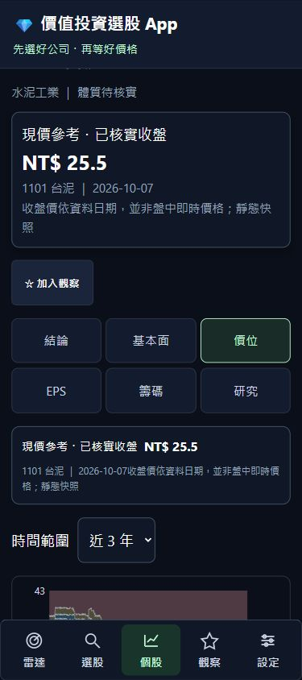

# 2026-10-08 開工接續與官方歷史回補

狀態：本輪官方歷史回補、來源查核、94檔靜態匯出及預覽驗證完成。使用者要求依建議順序補歷史、整理提交草稿、檢查預覽。尚未stage、commit、push或發布。行情回補不代表公司事件或真實策略已通過驗收。

## 已完成

- 9檔上櫃：3105、3264、3529、4966、5274、5347、5483、6223、6488，441個股票月份已跑完，匯入8,747筆，來源失敗0。資料為2022-10起的四年區間及2026-10已提供交易日。
- 其餘80檔上市整批972個交易日已跑完，匯入77,484筆，來源失敗0。加上既有5檔上市與9檔上櫃，94檔合計91,089筆已核實行情，各檔最新日期均為2026-10-07。
- 93檔涵蓋49個月份，6526涵蓋37個月份。12檔共有279個參考交易日差集，待掛牌、停牌及公司事件核實，不以缺列補假價格或斷言來源漏資料。
- SQLite完整性ok；91,254筆最新證據、91,484筆修訂版本hash均相符。701個月快照及972個日快照重新解析核對，失敗0。
- 上櫃月查詢的「成交仟股」與2025年起「成交張數」均依官方單位乘1000。換算值保留原始單位精度，不宣稱逐股精度；原始列未刪改。未知欄位明確失敗。
- 使用櫃買依日期查詢端點，抽查2022-10-03、2025-10-01、2026-10-07，9檔共27點，P/E及P/B全部一致。虧損的N/A保持未知。
- 上市全市場日資料與個股月查詢，於1101及1216的2022-10-03，對照收盤、成交量、開盤、最高、最低、P/E及P/B，七欄一致。
- 全套156項隔離測試通過；手機320／390／430px無橫向溢出，3105六個子頁同收盤588元、同日期2026-10-07。這是瀏覽器驗證，未做實機驗收。
- 94檔正式靜態資料已重新匯出。預覽發現瀏覽器HTTP快取沿用舊總表但新個股已載入；現為程式資源與公開JSON加入快照版本網址，契約測試核對不同批次使用不同URL。重載後1101總表／六子頁均為25.5元及2026-10-07，近三年河流圖726筆；320／390／430px無溢出。靜態資源與來源及版本識別另查核通過。
- 最終94檔、756個API／靜態端點一致，核對273,264個歷史列（四指標各自核對，同一日期重複計數），差異0；禁止私人欄位路徑0。快取修正後再次全套156項通過，469個既有棄用警告，114.48秒。

## 來源與匯入修正

原歷史腳本只有上市來源，現加入櫃買 `tradingStock` 及 `peQryStock`，核對股票、月份及所有資料列日期；不把第二張股利表當日倍數。證交所倍數標題是通用報表名稱，股票身份改由請求的stockNo核對，不能因標題沒有代碼而誤判。

上市最初密集查詢觸發HiNetCDN HTTP428流量防護，已停止該輪並保留已成功資料。低頻查詢恢復後，改用官方 [MI_INDEX每日全市場行情](https://www.twse.com.tw/exchangeReport/MI_INDEX?date=20221003&response=json&type=ALLBUT0999) 及 [本益比、殖利率及股價淨值比](https://www.twse.com.tw/exchangeReport/BWIBBU_d?date=20221003&response=json&type=ALL)，每次請求至少間隔3秒，避免為80家公司重複查同一交易日。櫃買來源為 [個股月行情API](https://www.tpex.org.tw/www/afterTrading/tradingStock?code=3105&date=2022/10/01&response=json) 與 [個股月倍數API](https://www.tpex.org.tw/www/afterTrading/peQryStock?code=3105&date=2022/10/01&response=json)。實際API URL保存在每份快照。

整批日查詢使用2330／2317／2454已核實交易日聯集972日，不以平日猜測市場日曆。完整原始JSON內容以gzip保存，另記原回應hash及UTC擷取時間。各個日期分別留存擷取時點；按月批次預載、寫入並commit，較舊快照不能覆寫較新行情。HTTP403／428／429或流量防護頁會停止；連線與空白回應只有限重試。部分匯入回傳非零退出碼。

完整月份快照可以跨資料日期重用；當月個股月查詢仍重新取得並保留版本。這些是官方歷史的事後重建，不是過去已保存的模型，也不能用來宣稱舊勝率或報酬。

## 保存與驗收順序

1. 等上市整批報告status為complete，再核對逐股起訖、月份及交易日差集。沒有有效成交列的日期列為查核線索，待核對掛牌、下市、停牌及公司事件，不補假資料。
2. 執行 `verify_history_evidence.py --check-snapshots`：SQLite完整性、最新與修訂版本hash、證據與行情表一致性、官方月／日快照重新解析對照。
3. 匯出94檔靜態快照，比較API與靜態歷史，確認私人觀察、研究筆記及LINE資料未匯出；再檢查本機正式與靜態預覽。
4. 保存SQLite一致備份、完整查核結果及明確Git提交清單。提交／推送另等具體草稿確認，推送會觸發CI及既有Pages發布。

完整財報、單季口徑、公告時點、現金流、股數、股利、ETF有效／歷史成分、籌碼、美債及公司事件仍未驗收。行情回補完成也不等於投資資料完備；正式排名、LINE推播及真實策略績效維持不足證據狀態。

## 驗證檔案

- 全套測試結果.txt、正式冒煙結果.txt
- 手機介面驗證.json、上櫃時間河流圖-390px.jpg
- 上櫃倍數交叉查核結果.json、上市整批與月查詢交叉查核.json
- 歷史證據查核-批次中途.json（中途狀態，不是最後驗收）
- 歷史證據查核.json（最終來源查核，失敗0）
- 靜態資源查核.json、靜態手機介面驗證.json、上市靜態河流圖-390px.png
- 靜態快照查核.json（94檔756端點，差異0、禁止私人欄位0）
- 下一輪財報缺口.json（23檔尚缺累計損益來源，全部股票仍待連續季報與其他財務證據）
- 私人SQLite一致備份：data/收工備份/20261008-114713/，完整性ok，排除Git。
- 歷史回補報告-*.json、上市整批回補報告-*.json（早期中斷／防護／格式修正的記錄保留，不覆寫）

